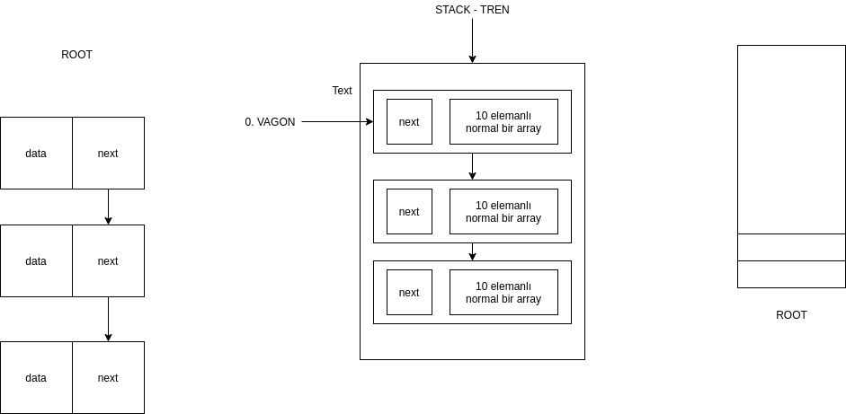

# Tren uygulaması 

Her bir lokomotifinde 10 tane koltuk olduğu varsayılan bir trene maksimum 20 adet lokomotif
eklenebilmektedir. (Lokomotif ekleme işlemi lokomotif dolduktan sonra yapılabilmeltedir) Yolcuların
sadece ilk lokomotiften trene binebildikleri ve her bir lokomotifte boş yer bırakmadan sıra ile koltuklara
oturabildikleri bir yapıyı yığın ve liste kullanarak tasarlayıp c, c++ dilinde kodlayınız.

NOT 1 : Herbir koltuğa ait ad, soyad ve koltuk numarası tutulmalıdır.

